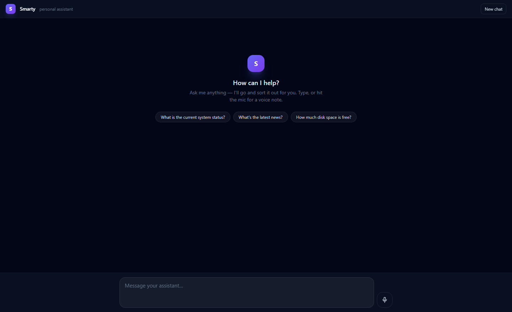
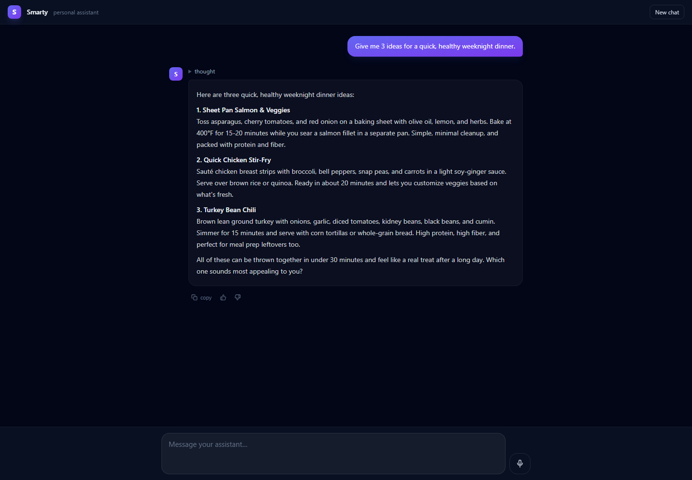

<div align="center">

# 🟣 Smarty

### Your own personal assistant — running entirely on your machine.

No cloud. No API keys. No subscriptions. Smarty talks to you like a real assistant, then quietly
goes off and *does the thing* — researches the web, checks your system, runs background tasks — all on
a local model you control.



</div>

---

## What is it?

Most "AI assistants" are a chat box bolted to someone else's servers — you type, you **wait**, you get
one answer, repeat. Smarty isn't that. It's a **local-first personal assistant built to work the way a
real assistant actually would**: you ask, it gets going, and you both carry on.

## ⚡ The magic: it works *while you keep talking*

This is the whole point of Smarty, and it's what makes it feel different from every other chatbot.

When you ask Smarty to do something real, it doesn't freeze the chat and leave you watching a spinner.
It says **"on it"** and goes off to do the work **in the background** — so you can keep chatting, ask
something else, or fire off *more* jobs. Smarty runs them **all at once**, keeps you posted while
they're going, and drops each result back into the conversation the moment it's ready.

And because the work is *live*, you can **change your mind mid-flight** — add a detail, narrow it
down, or call the whole thing off — and Smarty folds it into the job that's already running instead of
starting from scratch.

Here's what that actually feels like:

> **You:** Find me somewhere nice for dinner in Soho this Friday.
>
> **Smarty:** On it — give me a sec. 🍝 *(starts researching in the background)*
>
> **You:** Oh, what's the weather looking like Friday night?
>
> **Smarty:** Clear and mild, around 14°C — lovely evening for it. *(answered instantly, while the restaurant search keeps running)*
>
> **You:** Actually, make the dinner search vegetarian-friendly.
>
> **Smarty:** Got it — folding that into the search.
>
> **Smarty:** *(a moment later)* Found a few good ones — Mildreds, Mao Chow, and Temple of Seitan all have tables Friday. Want me to book?

No waiting. No "please hold." Three things happened at once — a restaurant search, a weather question,
and a mid-task change — and **you never stopped talking.** That's the difference: it's less "chatbot,"
more "handing things to someone capable."

Under the hood you talk to one friendly voice — the **orchestrator** — which routes real work to
background **workers**, juggles however many are running, lets you steer or cancel them on the fly, and
relays everything back in plain language.

## 🧰 What it can actually do — tools

Smarty's workers don't just talk; they have real **tools** and use them to get you real answers:

- 🌐 **`web_search`** — searches the web, with automatic engine fallback so a rate-limit doesn't dead-end it.
- 📄 **`get_page_answer`** — actually opens a page, reads it, and extracts the answer — *grounded in the
  real content,* not guessed from memory.
- 🖥️ **`run_shell_command`** — your machine's shell: system info, files, scripts, local APIs — anything
  you could type yourself.
- 📊 **System info** — disk, memory, CPU, and OS, read straight from the OS.

It's all built on a small, **tool-first agent framework** (`Smarty.Agents`), so adding a new capability
is just adding a tool: give it a name, a one-line description, and what to run — and the model can use
it. Want Smarty to control your lights, hit your calendar, or query your database? That's a tool.

<div align="center">

</div>

### Also in the box

- 🎙️ **Voice notes** — talk to it; local Whisper transcribes on-device.
- 🧠 **Thinks before it answers** — and tells you when it *can't* get something instead of fabricating.
- 📈 **Learns from use** — every interaction (and your 👍/👎) is logged locally toward a future fine-tune.
- 🔒 **100% local** — your data never leaves the machine.

---

## How it works

```
            you  ⇄  Orchestrator  ──delegates──►  Worker(s)
                   (talks, routes,                (shell · web_search ·
                    relays, manages tasks)         get_page_answer · system info)
                          │                              │
                          └────────── local Ollama ◄─────┘
                                   (one model, two roles)
```

- **`Smarty.Chat`** — a React + Vite + Tailwind web UI (streamed replies, voice notes, feedback).
- **`Smarty.Api`** — an ASP.NET Core service: the orchestrator, the workers, Whisper transcription, and
  the persistent event stream. Serves the UI too, so it's a single origin.
- **`Smarty.Agents`** — a small, dependency-light C# agent framework (agents, tools, the Ollama
  provider) that everything is built on.

Everything runs against a local [**Ollama**](https://ollama.com) model (default **`qwen3.5:latest`**).

---

## Setup

Get it running from scratch. Commands shown for **Windows**; macOS/Linux notes inline.

### 1. Prerequisites

| You need | Why | Get it |
|---|---|---|
| **[Ollama](https://ollama.com/download)** | runs the local model | one-click installer |
| **[.NET 7 SDK](https://dotnet.microsoft.com/download/dotnet/7.0)** | builds & runs the API | installer |
| **[Node.js 18+](https://nodejs.org)** | builds the web UI | installer |
| A GPU with **~8 GB VRAM** (recommended) | speed | optional — runs on CPU, just slower |

### 2. Pull a model

```bash
ollama pull qwen3.5:latest
```

> 💡 On lighter hardware? `ollama pull qwen3.5:4b` is ~2× faster (set the model in step 4). `qwen3.5:latest`
> (a 9.7B model, ~6 GB) is the recommended default if you've got the VRAM.

Make sure Ollama is running (`ollama serve`, or it starts automatically after install).

### 3. Get the code

```bash
git clone https://github.com/AlexConnolly/smarty.git
cd smarty
```

### 4. Build the web UI

```bash
cd Smarty.Chat
npm install
npm run build      # outputs to Smarty.Chat/dist, which the API serves
cd ..
```

### 5. Run it

```bash
cd Smarty.Api
dotnet run
```

Then open **<http://localhost:5179>** — and say hi. 🎉

> 📱 **Use it from your phone:** the API binds all interfaces, so on the same Wi-Fi just visit
> `http://<your-pc-lan-ip>:5179`.

That's it — chat, web research, voice notes, and system queries all work out of the box. (The Whisper
voice model downloads itself on first use.)

---

## Configuration

Override anything via `Smarty.Api/appsettings.json` or environment variables (`__` = nested key):

| Setting | Env var | Default | What it does |
|---|---|---|---|
| `Ollama:Model` | `Ollama__Model` | `qwen3.5:latest` | which local model to use |
| `Ollama:BaseUrl` | `Ollama__BaseUrl` | `http://localhost:11434` | where Ollama is |
| `Urls` | `Urls` | `http://localhost:5179` | what address to serve on |
| `Whisper:ModelPath` | `Whisper__ModelPath` | `models/ggml-base.bin` | local voice model (auto-downloads) |
| `Training:Dir` | `Training__Dir` | `Smarty.Api/training-data` | where interaction/feedback logs go |

Example — run faster on a smaller model:

```bash
Ollama__Model=qwen3.5:4b dotnet run        # macOS/Linux
$env:Ollama__Model="qwen3.5:4b"; dotnet run  # Windows PowerShell
```

---

## Project layout

```
smarty/
├── Smarty.Api/        ASP.NET Core API — orchestrator, workers, Whisper, SSE  (also serves the UI)
├── Smarty.Chat/       React + Vite + Tailwind web client
├── src/Smarty.Agents/ the C# agent framework (agents, tools, Ollama provider)
├── samples/           a minimal console sample
└── tests/             unit tests for the agent framework
```

---

## Status & notes

Smarty is an evolving personal project — a local-first take on what a genuinely useful assistant could
be. Reliability is bounded by whatever local model you run; it's designed to **fail honestly** (tell you
when it can't get something) rather than fabricate. Contributions and ideas welcome.

*Built with C#, React, and a local LLM. Powered by [Ollama](https://ollama.com).*
