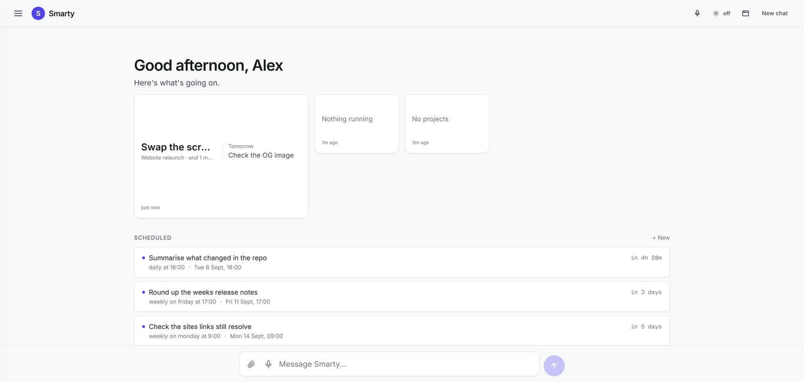
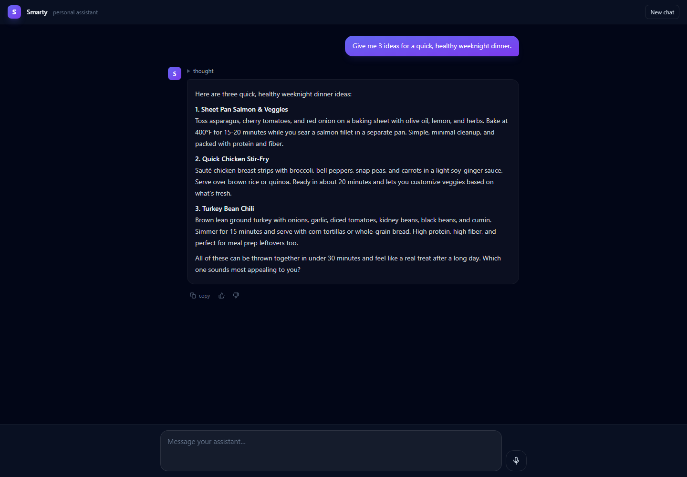

<div align="center">

# 🟣 Smarty

### Your own personal assistant — running on your machine, on a model you choose.

No subscription, no walled garden, nothing you can't swap out. Smarty talks to you like a real assistant,
then quietly goes off and *does the thing* — researches the web in your own browser, checks your system, runs
background tasks. Point it at a frontier model for the sharpest tool use, or at a local one and nothing leaves
the machine at all.



</div>

---

## What is it?

Most AI assistants are a chat box bolted to someone else's servers — you type, you **wait**, you get one
answer. Smarty works the way a real assistant would: you ask, it gets going, and you both carry on.

## ⚡ It works while you keep talking

Ask Smarty for something real and it doesn't freeze the chat — it gets going in the background and hands
the conversation straight back to you:

> **You:** What's the latest news?
>
> **Smarty:** Checking that out for you now — anything else I can help with while I work on it?

So you keep chatting, kick off more jobs, or change your mind mid-task. Smarty runs them all at once,
re-steers when you do, and drops each result in the moment it's ready. Less chatbot, more handing things
to someone capable.

## 🧰 What it can actually do — tools

Smarty's workers don't just talk; they have real **tools** and use them to get you real answers:

- 🌐 **A real browser** — the web arrives through *your actual Chrome*, not a fetch-and-guess. Smarty opens
  the page, reads what rendered, and answers from that — including searching, which is just another page it
  reads. Grounded in what's on screen, or it tells you it couldn't get there.
- 🖥️ **`run_shell_command`** — your machine's shell: system info, files, scripts, local APIs — anything
  you could type yourself.
- 📊 **System info** — disk, memory, CPU, and OS, read straight from the OS.

> The old fetch-based pair (`web_search` + `get_page_answer`) is **gone**. It answered from snippets and dead
> HTML and returned nothing on pages that render their content — so web access is now the browser, supplied by
> an MCP server. **No browser server configured means no web access**, and the API says so loudly at startup.

It's all built on a small, **tool-first agent framework** (`Smarty.Agents`), so adding a new capability
is just adding a tool: give it a name, a one-line description, and what to run — and the model can use
it. Want Smarty to control your lights, hit your calendar, or query your database? That's a tool.

### 🔌 …and any **MCP server** you point it at

Smarty speaks the **Model Context Protocol**, so a tool doesn't have to be one you wrote: name a server in
`data/mcp.json` and its tools show up as Smarty's own — same registry as the built-in integrations, same
control-centre listing, same personas. Out of the box that includes
[open-chrome-mcp](https://github.com/AlexConnolly/open-chrome-mcp), which drives the **actual Chrome you're
already signed into** — so "log into the portal and pull yesterday's numbers" is now a thing Smarty can do,
not just read about. See [MCP servers](#-mcp-servers) below.

<div align="center">

</div>

### 🧱 …and **plugins**, if you'd rather write a class than a server

A plugin is a DLL you wrote, zipped and dropped onto the control centre. Implement `IPlugin` — a name, the
steps to set it up, and a list of commands — and Smarty turns it into tools **and a persona to delegate them
to**, live, without a restart. It remembers what setup established; upgrade it by uploading again and it keeps
everything.

```csharp
public IReadOnlyList<PluginCommand> GetCommands(IPluginState state) => new[]
{
    new PluginCommand("start", "Send the vacuum out to clean a room.",
        new Dictionary<string, PluginParameter> { ["room"] = PluginParameter.Text("Which room.", required: true) },
        async (p, ct) => await Clean(p.Require("room"), ct)),
};
```

Setting one up is a sequence of stages it defines itself, so a step can *do* something — send you a sign-in
code — and ask about the result. Until setup finishes, Smarty registers nothing: no tools, no persona. And
nothing typed during setup is ever a command parameter, so a password or a one-time code never reaches a model.

Two working ones are in the box: **Weather** (Open-Meteo, no account needed) and **Roborock**, which signs
into your account and runs the vacuums — `roborock_status`, `roborock_clean`, `roborock_clean_rooms`
("kitchen, hallway"), `roborock_stop`, `roborock_dock`. Give it your email, it emails you a code, you type the
code — once. With more than one vacuum it works out which is which from the rooms, and "back to the dock"
means all of them. It
ships its own MQTT client inside its zip, which is the point — Smarty gains no dependency on one. The whole
thing is written up in [`PLUGINS_SPEC.md`](PLUGINS_SPEC.md).

### Also in the box

- 🎙️ **Voice notes** — talk to it; local Whisper transcribes on-device.
- 🧠 **Thinks before it answers** — and tells you when it *can't* get something instead of fabricating.
- 📈 **Learns from use** — every interaction (and your 👍/👎) is logged locally toward a future fine-tune.
- 🔒 **100% local** — your data never leaves the machine.

---

## How it works

```
            you  ⇄  Orchestrator  ──delegates──►  Worker(s)
                   (talks, routes,                (shell · browser (MCP) ·
                    relays, manages tasks)          files · memory · system info)
                          │                              │
                          └───────── one model ◄─────────┘
                                  (two roles)
```

- **`Smarty.Chat`** — a React + Vite + Tailwind web UI (streamed replies, voice notes, feedback).
- **`Smarty.Api`** — an ASP.NET Core service: the orchestrator, the workers, Whisper transcription, and
  the persistent event stream. Serves the UI too, so it's a single origin.
- **`Smarty.Agents`** — a small, dependency-light C# agent framework (agents, tools, the model
  providers, the MCP client) that everything is built on.

The base model is **DeepSeek V4 Flash** (`deepseek-ai/DeepSeek-V4-Flash-0731`) on
[**Together AI**](https://www.together.ai/models/deepseek-v4-flash-0731). A **local
[Ollama](https://ollama.com) model works just as well** — the provider is chosen from the model id, so it's a
one-line switch either way. See [step 2](#2-get-a-model).

---

## Setup

Get it running from scratch. Commands shown for **Windows**; macOS/Linux notes inline.

### 1. Prerequisites

| You need | Why | Get it |
|---|---|---|
| A **[Together AI](https://api.together.xyz/settings/api-keys)** key *or* **[Ollama](https://ollama.com/download)** | runs the model — remote or local, your choice | key / one-click installer |
| **[.NET 7 SDK](https://dotnet.microsoft.com/download/dotnet/7.0)** | builds & runs the API | installer |
| **[Node.js 18+](https://nodejs.org)** | builds the web UI | installer |
| A GPU with **~8 GB VRAM** | only if you run a local model | optional — runs on CPU, just slower |

### 2. Get a model

**The provider is chosen from the model id**: an id with a `/` in it is a Together AI model, anything else is a
tag on the Ollama gateway at `Ollama:BaseUrl`. One setting, either world.

**Default — DeepSeek V4 Flash on Together AI.** 284B parameters with 13B active, a 1M-token context, and built
for tool use, which is the whole job here. It needs a key in the environment:

```powershell
$env:TOGETHER_API_KEY = "<your key>"    # Windows PowerShell
export TOGETHER_API_KEY="<your key>"    # macOS/Linux
```

> 🔒 **Prefer everything on the machine?** Pull a local model and name it — nothing then leaves your machine:
>
> ```bash
> ollama pull qwen3.5:latest
> Ollama__Model=qwen3.5:latest dotnet run          # macOS/Linux
> $env:Ollama__Model="qwen3.5:latest"; dotnet run  # Windows PowerShell
> ```
>
> That's the trade: V4 Flash's tool-calling, or local-only. Everything else in Smarty works either way, and
> reliability is bounded by whichever model you pick.

If you're running locally, make sure Ollama is up (`ollama serve`, or it starts automatically after install).

### 3. Get the code

```bash
git clone https://github.com/AlexConnolly/smarty.git
cd smarty
```

### 4. Build the web UI

```bash
cd Smarty.Chat
npm install
npm run build      # outputs to Smarty.Chat/dist, which the API serves
cd ..
```

### 5. Run it

```bash
cd Smarty.Api
dotnet run
```

Then open **<http://localhost:5179>** — and say hi. 🎉

> 📱 **Use it from your phone:** the API binds all interfaces, so on the same Wi-Fi just visit
> `http://<your-pc-lan-ip>:5179`.

That's it — chat, voice notes and system queries work out of the box. Web research needs a browser server
configured; see [MCP servers](#-mcp-servers). (The Whisper voice model downloads itself on first use.)

---

## Configuration

Override anything via `Smarty.Api/appsettings.json` or environment variables (`__` = nested key):

| Setting | Env var | Default | What it does |
|---|---|---|---|
| `Ollama:Model` | `Ollama__Model` | `deepseek-ai/DeepSeek-V4-Flash-0731` | which model to use — **and, by whether it has a `/`, which provider** |
| `Ollama:BaseUrl` | `Ollama__BaseUrl` | `http://localhost:11434` | where the Ollama gateway is (ignored for Together models) |
| — | `TOGETHER_API_KEY` | *(unset)* | required for a Together model |
| `Urls` | `Urls` | `http://localhost:5179` | what address to serve on |
| `Whisper:ModelPath` | `Whisper__ModelPath` | `models/ggml-base.bin` | local voice model (auto-downloads) |
| `Training:Dir` | `Training__Dir` | `Smarty.Api/training-data` | where interaction/feedback logs go |
| `Mcp:ConfigPath` | `Mcp__ConfigPath` | `Smarty.Api/data/mcp.json` | which MCP servers to run |

> The model keys are still named `Ollama:*` for compatibility — they select the model and gateway for whichever
> provider the id resolves to (`ModelRouting` in `Smarty.Agents` is the one place that rule lives).

---

## 🔌 MCP servers

An **MCP server** is a separate process that publishes tools over a small JSON-RPC protocol. Smarty runs the
ones you list, discovers what they offer, and hands those tools to its workers as if they'd been written into
the codebase — a persona asks for a *capability*, the registry resolves it, and the worker just has the tools.

Servers live in **`Smarty.Api/data/mcp.json`** (that folder is gitignored, so it can hold real paths and
credentials). Copy [`Smarty.Api/mcp.example.json`](Smarty.Api/mcp.example.json), which documents every field:

```jsonc
{
  "mcpServers": {
    "chrome": {
      "command": "node",
      "args": ["%USERPROFILE%\\open-chrome-mcp\\server\\src\\index.js"],
      "env": { "OPEN_CHROME_MCP_PORT": "8777" },
      "functions": ["browser"],
      "promptHint": "Call chrome_tabs_context first, then chrome_navigate and chrome_read_page…"
    }
  }
}
```

- **`functions`** is how a persona reaches it: the server claims `browser`, and the built-in **Browser
  Operator** persona asks for `browser`. Swap in a different browser server and the persona is unchanged.
- **Tools are prefixed** with the entry's name — `chrome_navigate`, `chrome_read_page` — so two servers can
  both offer a `navigate`.
- **Nothing is required.** No file, an unreachable server, a missing Node: that server contributes no tools,
  says why, and the app boots as normal. Each connection is bounded by its own `startupTimeoutSeconds`.
- **A dead server is reconnected** on the next call, so a browser bridge that drops doesn't poison the session.

Check what came up at **<http://localhost:5179/api/control/mcp>** — every server, the tools it offered, and the
reason for any that didn't connect. They also appear in the control centre alongside the built-in integrations.

### Driving your real browser (open-chrome-mcp)

[open-chrome-mcp](https://github.com/AlexConnolly/open-chrome-mcp) drives the Chrome you already use — your
profile, your sessions — over the DevTools protocol, with nothing leaving the machine:

1. Load `open-chrome-mcp/extension` in Chrome via `chrome://extensions` → *Load unpacked*.
2. Add the `chrome` entry above to `data/mcp.json`, pointing at your checkout.
3. Restart the API. You should see `[mcp:chrome] connected to open-chrome-mcp … 16 tool(s)`.

Then just ask for something that needs a browser — the work is routed to the Browser Operator, which reads the
page and clicks through it rather than guessing at a URL.

> ⚠️ **An MCP server runs with your privileges** — `chrome_javascript` can read any token the page can, and a
> filesystem server can read your files. Only list servers you've read or trust, and use `tools` to narrow one
> to the calls you actually want available.

---

## Project layout

```
smarty/
├── Smarty.Api/        ASP.NET Core API — orchestrator, workers, Whisper, SSE  (also serves the UIs)
├── Smarty.Chat/       React + Vite + Tailwind web client
├── Smarty.Control/    the command centre — live view of every conversation, task, file, memory & persona
│                      (served by Smarty.Api at /control; see Smarty.Control/README.md)
├── Smarty.Slack/      Slack gateway (separate process; forwards its activity to the control hub)
├── src/Smarty.Agents/ the C# agent framework (agents, tools, model providers, MCP client)
├── samples/           a minimal console sample
└── tests/             unit tests for the agent framework
```

---

## Status & notes

Smarty is an evolving personal project — a local-first take on what a genuinely useful assistant could
be. Reliability is bounded by whatever local model you run; it's designed to **fail honestly** (tell you
when it can't get something) rather than fabricate. Contributions and ideas welcome.

*Built with C#, React, and a local LLM. Powered by [Ollama](https://ollama.com).*
